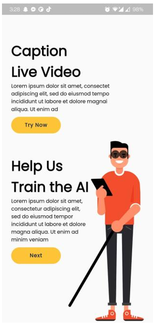
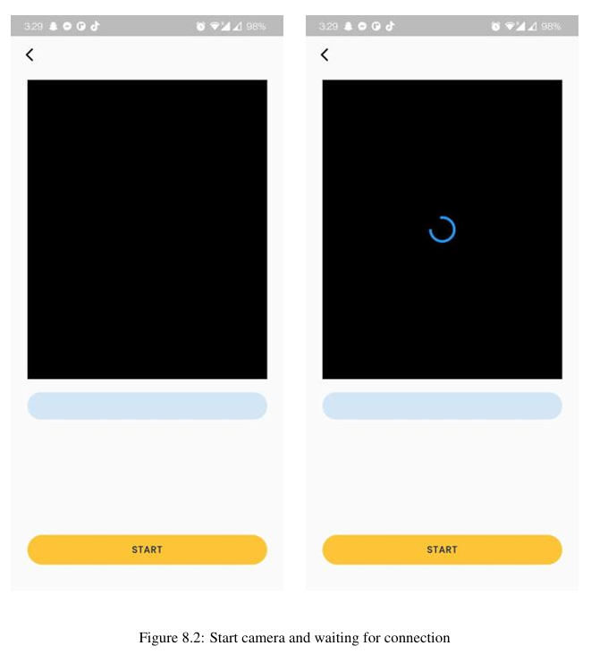
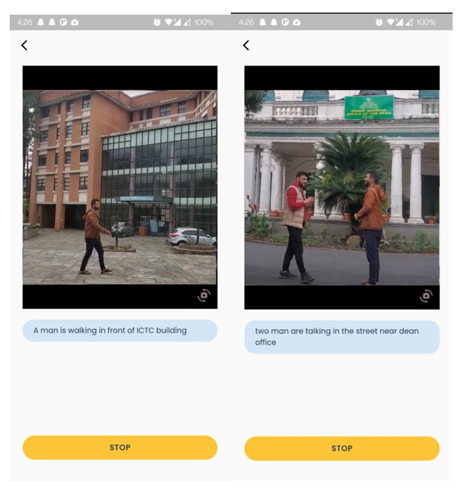

# Live Camera Feed Scene Descriptor for Visually Impaired

A real-time video captioning system that helps visually impaired users by describing live camera scenes using machine learning. The app captures video via a mobile device, streams it to a Python backend over WebRTC, generates natural language captions using Microsoft's GIT model, and speaks them aloud through text-to-speech.

## Screenshots

<p align="center">
  
  
  
  
</p>

## How It Works

```
Flutter App (Camera) → WebRTC Video Stream → Python Backend
                                                  ↓
                                          Frame Buffer (5s)
                                                  ↓
                                          Sample 6 Frames
                                                  ↓
                                        ML Inference (GIT Model)
                                                  ↓
                                          Caption Text
                                                  ↓
Flutter App (TTS + Display) ← WebRTC Data Channel ←
```

1. The mobile app captures a live camera feed and establishes a WebRTC peer connection
2. The server collects video frames over a 5-second window, then samples 6 evenly-spaced frames
3. Frames are preprocessed (resized to 224x224, normalized) and fed to the GIT vision-language model
4. The generated caption is sent back via a WebRTC data channel
5. The app displays the caption and reads it aloud using text-to-speech

## Tech Stack

| Layer | Technologies |
|-------|-------------|
| **Backend** | Python 3.10+, aiohttp, aiortc, PyTorch, HuggingFace Transformers |
| **Frontend** | Flutter 3.x, Dart, flutter_webrtc, flutter_tts, Provider |
| **ML Model** | Microsoft GIT (Generative Image-to-Text), trained on VATEX |
| **Streaming** | WebRTC (peer-to-peer video + data channels) |
| **Infrastructure** | Docker, Make |

## Getting Started

### Prerequisites

- Python 3.10+ with pip
- Flutter SDK 3.0+
- Git

### Backend Setup

```bash
cd Backend

# Create virtual environment
python -m venv venv
source venv/bin/activate   # macOS/Linux
# venv\Scripts\activate    # Windows

# Install dependencies
pip install -r requirements.txt

# Copy and configure environment variables
cp .env.example .env

# Run the server
python -m scene_descriptor --host 0.0.0.0 --port 8080
```

Or using Make:

```bash
cd Backend
make install
make run
```

### Frontend Setup

```bash
cd Frontend

# Install dependencies
flutter pub get

# Run the app
flutter run
```

> **Note:** Update the server URL in `Frontend/lib/config/app_config.dart` to match your backend's IP address.

### Docker

```bash
cd Backend
docker-compose up -d
```

To enable GPU support, uncomment the `deploy` section in `docker-compose.yml`.

## Project Structure

```
├── Backend/
│   ├── src/scene_descriptor/   # Main Python package
│   │   ├── api/                # HTTP routes and handlers
│   │   ├── config/             # Settings and ML constants
│   │   ├── models/             # ML model management
│   │   ├── services/           # Caption and video services
│   │   ├── webrtc/             # Peer connection and tracks
│   │   ├── utils/              # Logging, exceptions, state
│   │   └── enums/              # Status enumerations
│   ├── scripts/                # Batch captioning scripts
│   ├── tests/                  # Test suite
│   ├── ml-models/              # ML model weights (not tracked)
│   ├── Makefile                # Build automation
│   ├── docker-compose.yml      # Docker orchestration
│   └── pyproject.toml          # Package configuration
│
├── Frontend/
│   └── lib/
│       ├── config/             # App configuration
│       ├── screens/            # Splash, Home, Live Caption
│       ├── widgets/            # Reusable UI components
│       ├── services/           # API services
│       ├── provider/           # State management
│       └── constants/          # Colors, styles, assets
│
├── ARCHITECTURE.md             # Detailed architecture docs
└── guides/                     # Setup guides
```

## API Endpoints

| Method | Endpoint | Description |
|--------|----------|-------------|
| POST | `/offer` | WebRTC signaling — accepts SDP offer, returns answer |
| POST | `/change_model` | Switch between ML models (git / pulchowk) |
| GET | `/health` | Health check |

## Configuration

Key environment variables (see `Backend/.env.example`):

| Variable | Default | Description |
|----------|---------|-------------|
| `HOST` | `0.0.0.0` | Server bind address |
| `PORT` | `8080` | Server port |
| `DEFAULT_MODEL` | `git` | ML model (`git` or `pulchowk`) |
| `CUDA_DEVICE` | `cuda:0` | GPU device or `cpu` |
| `FRAME_CAPTURE_SECONDS` | `5` | Frame buffer duration |
| `NUM_SAMPLE_FRAMES` | `6` | Frames sampled per inference |
| `MAX_CAPTION_LENGTH` | `20` | Max tokens in generated caption |
| `LOG_LEVEL` | `INFO` | Logging verbosity |

## Development

```bash
cd Backend

# Install dev dependencies
make dev-install

# Run tests
make test

# Format code (black, isort)
make format

# Lint (flake8, mypy)
make lint

# Run with debug logging
make run-debug

# View logs
make logs
```

## License

This project is licensed under the MIT License.
